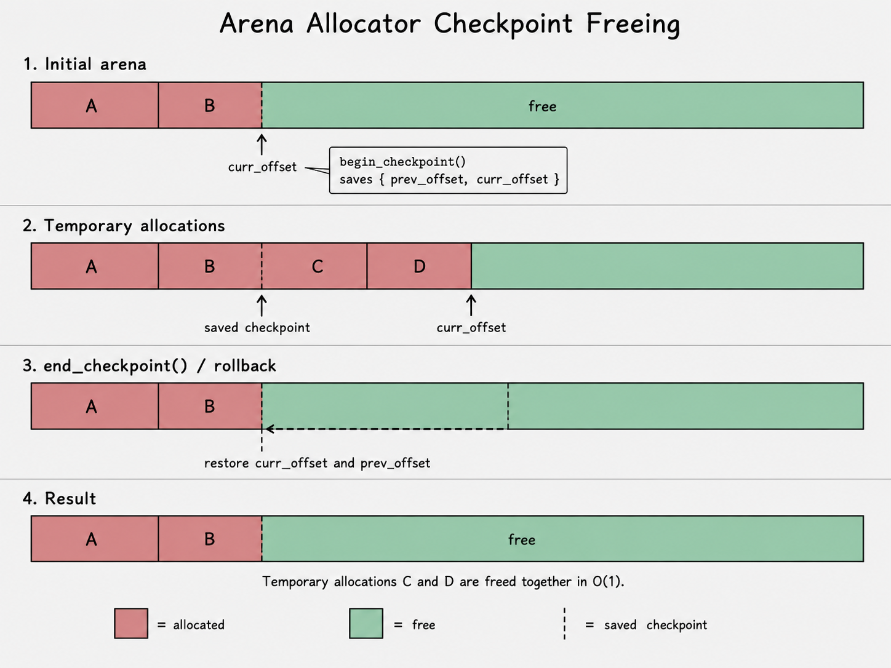

# Arena Allocator

An **arena allocator**, also known as a **region allocator**, is a memory allocation strategy where many allocations are grouped together and released together.

In many implementations, an arena works as a **bump allocator**. Instead of asking the operating system or heap allocator for memory every time, the arena first allocates a larger memory block. Then, every small allocation simply moves a pointer forward inside that block.

This makes allocation very fast. In most cases, allocation is just:

```text
align current position
return pointer
move pointer forward
```

So allocation is usually `O(1)`.

The tradeoff is that arena allocators do not work like normal `new` / `delete` or `malloc` / `free`. You usually cannot free one random allocation in the middle. Instead, you free everything at once, or roll the arena back to some earlier checkpoint.

---

## Basic Idea

At the lowest level, an arena only needs to know where the next allocation should happen.

It can store this as a pointer or as an offset inside the current memory page.

> Other metadata can also be stored, such as allocation count, previous allocation offset, page count, or debug information.


### Allocation

When the user asks for memory, the arena checks the current position, aligns it if needed, returns that address, and then moves the current position forward.


The important part is that the allocator does not search for a free block.

It does not walk a free list.
It does not split memory blocks.
It does not merge freed blocks.

It only moves forward.

That is why arena allocation is so fast.

### Freeing

The simplicity of arena allocation also creates its biggest limitation: individual allocations usually cannot be freed independently.

For example, if the arena contains these allocations:

```text
[ A ][ B ][ C ][ D ][ free space ]
```

we cannot safely free only `B` while keeping `A`, `C`, and `D` in place.

However, we can roll back the arena to an earlier checkpoint. This means we can free a suffix of allocations.



For example:

```text
checkpoint created after B

[ A ][ B ][ C ][ D ][ free space ]
          ^
          checkpoint
```

Rolling back to that checkpoint removes `C` and `D`, but keeps `A` and `B`.

This is useful for temporary allocations, but it has a clear rule:

```text
Only allocations made after the checkpoint can be discarded.
```

So checkpoints are powerful, but they are not the same as arbitrary `free()`.

---

## Implementation Details

Before looking at the pseudo-code, there are two important details: alignment and page allocation.

### Memory Alignment

[Memory alignment](https://en.wikipedia.org/wiki/Data_structure_alignment) means that some objects must be placed at addresses divisible by a certain number.

For example, if an object requires 8-byte alignment, then its address should be divisible by 8.

```text
valid 8-byte aligned address:   0x1000
invalid 8-byte aligned address: 0x1003
```

On some systems, bad alignment only hurts performance. On other systems, it can be invalid or cause expensive memory access.

Because of this, the arena must align the current offset before returning memory.

Example:

```text
current offset = 13
alignment      = 8

aligned offset = 16
```

So if the current position is not properly aligned, the arena adds padding before the allocation.

```text
[ used bytes ][ padding ][ allocated object ][ free space ]
```

### Page-Based Allocation

The arena does not request memory from the system for every object.

Instead, it allocates larger chunks of memory called **pages**. Then it serves many smaller allocations from those pages.

This is the main idea:

```text
system allocation:
    allocate one large page

arena allocations:
    carve smaller pieces from that page
```

There are several possible [page size allocation strategies](./arena-page-size.md).

---

## Implementation Pseudo-Code

### Constants / Configuration

```text
initial_page_size = 64 KB
large_threshold   = 16 KB
max_page_size     = 1 MB
default_alignment = alignof(max_align_t)
poison_byte       = 0xCD
```

The arena keeps two groups of pages:

```text
pages = []   // normal pages for small allocations
large = []   // separate pages for large allocations
```

Normal pages are reused for many small allocations.

Large pages are used for allocations that are big enough that they should not be packed into the normal arena pages.

Each page stores:

```text
Page:
    base  // pointer to allocated memory
    cap   // total page capacity
    used  // number of bytes already used
```

---

## Main Allocation

```text
function alloc(size, alignment):
    if size == 0:
        return null

    if alignment == 0:
        return error("invalid alignment")

    if alignment is not power of two:
        return error("invalid alignment")

    if alignment > alignof(max_align_t):
        return error("unsupported alignment")

    if size >= large_threshold:
        return alloc_large(size, alignment)

    return alloc_small(size, alignment)
```

The allocation path is simple:

```text
small object -> normal arena page
large object -> separate large page
```

This keeps small allocations fast and prevents large allocations from wasting space inside normal pages.

---

## Small Allocation

```text
function alloc_small(size, alignment):
    if pages is empty:
        new_size = get_next_page_size(size)
        page = allocate_page(new_size)
        pages.push(page)

    current = pages.back()

    offset = align_up(current.used, alignment)

    if offset + size > current.cap:
        new_size = get_next_page_size(size)
        page = allocate_page(new_size)
        pages.push(page)

        current = pages.back()
        offset = align_up(current.used, alignment)

    if offset + size > current.cap:
        return error("not enough space")

    result = current.base + offset
    current.used = offset + size

    return result
```

A small allocation is just a bump inside the current page.

```text
old used position
      |
      v
[ used bytes ][ padding ][ allocated object ][ free space ]
                         ^
                         returned pointer
```

After the allocation, the `used` value is moved forward.

The arena does not remember every small allocation separately. It only remembers how much of the page has been used.

That is what makes allocation cheap.

---

## Page Size Growth

When the arena needs a new normal page, it does not always allocate the same size.

Instead, the page size grows over time.

```text
function get_next_page_size(requested_size):
    required = align_up(requested_size, alignof(max_align_t))

    if required > max_page_size:
        return error("allocation too large")

    if pages is empty:
        return max(initial_page_size, required)

    previous = pages.back().cap

    doubled = previous * 2

    if doubled > max_page_size:
        doubled = max_page_size

    return max(doubled, required)
```

The basic rule is:

```text
next_page_size = max(previous_page_size * 2, requested_size)
```

but the page size is capped:

```text
next_page_size <= max_page_size
```

So the normal growth pattern can look like this:

```text
64 KB -> 128 KB -> 256 KB -> 512 KB -> 1 MB -> 1 MB -> ...
```

This strategy avoids allocating too many tiny pages, while still preventing the arena from growing without limit.

### Example

```text
previous page        = 4 KB
requested allocation = 12 KB
large_threshold      = 16 KB

doubled page = 8 KB
required     = 12 KB

new page size = max(8 KB, 12 KB)
              = 12 KB
```

The requested allocation is still smaller than the large allocation threshold, so it can become a normal arena page.

After that, future pages continue growing from the last page size.

---

## Large Allocation

```text
function alloc_large(size, alignment):
    page = allocate_page(size)
    page.used = size

    large.push(page)

    return page.base
```

Large allocations are stored separately.

```text
if size >= large_threshold:
    allocate one separate page for this object
```

This prevents a big object from disturbing the normal small-page growth pattern.

For example:

```text
small pages:
[64 KB page][128 KB page][256 KB page]

large pages:
[40 KB object][100 KB object][300 KB object]
```

Each large allocation owns its own page.

Because pages are allocated with at least `alignof(max_align_t)` alignment, and this arena rejects alignments larger than `alignof(max_align_t)`, the returned page base already satisfies the requested alignment.

---

## Page Allocation

```text
function allocate_page(capacity):
    if capacity == 0:
        return error("invalid page capacity")

    memory = operator_new(capacity, alignof(max_align_t))

    fill memory with poison byte 0xCD

    return Page {
        base = memory,
        cap  = capacity,
        used = 0
    }
```

The poison byte is mainly for debugging.

In this implementation, unused or rolled-back memory is filled with:

```text
0xCD
```

This makes it easier to recognize memory that should not be used anymore.

---

## Alignment Helper

```text
function align_up(value, alignment):
    mask = alignment - 1

    if value + mask overflows:
        return error("allocation too large")

    return (value + mask) & ~mask
```

This helper assumes that `alignment` is a power of two.

Examples:

```text
align_up(13, 8) = 16
align_up(16, 8) = 16
align_up(17, 8) = 24
```

So the arena always returns properly aligned memory.

---

## Checkpoints

A checkpoint saves the current state of the arena.

It does not copy memory.
It does not duplicate allocations.
It only remembers enough metadata to restore the arena position later.

```text
Checkpoint:
    page_count   // number of small pages
    page_used    // used offset of the last small page
    large_count  // number of large pages
```

```text
function checkpoint():
    return Checkpoint {
        page_count  = pages.size
        page_used   = pages.empty ? 0 : pages.back().used
        large_count = large.size
    }
```

The `page_used` value belongs to the last small page that existed when the checkpoint was created.

This is enough information to remove everything allocated after the checkpoint.

---

## Rollback to Checkpoint

```text
function rollback(checkpoint):
    while pages.size > checkpoint.page_count:
        free pages.back()
        pages.pop_back()

    if pages is not empty:
        pages.back().used = min(pages.back().used, checkpoint.page_used)

        fill unused part of last page with poison byte 0xCD

    while large.size > checkpoint.large_count:
        free large.back()
        large.pop_back()
```

Rollback does two things:

```text
1. Frees pages created after the checkpoint.
2. Restores the used offset of the last surviving page.
```

Before rollback:

```text
pages:
[ page 0 ][ page 1 ][ page 2 ]
                    ^
                    current page

checkpoint:
page_count = 2
page_used  = old offset in page 1
```

After rollback:

```text
pages:
[ page 0 ][ page 1 ]
              ^
              used restored to checkpoint offset

page 2 is freed
large allocations after checkpoint are freed
```

This makes temporary allocation easy:

```text
cp = arena.checkpoint()

temp1 = arena.alloc(...)
temp2 = arena.alloc(...)
temp3 = arena.alloc(...)

arena.rollback(cp)
```

After rollback, `temp1`, `temp2`, and `temp3` must not be used anymore.

Their memory no longer belongs to valid live allocations.

---

## Reset

```text
function reset(release_all):
    if release_all:
        free every small page
        free every large page

        pages.clear()
        large.clear()

    else:
        free all small pages except the first one

        if first page exists:
            first_page.used = 0
            fill first page with poison byte 0xCD

        free every large page
        large.clear()
```

`reset(true)` fully releases all memory owned by the arena.

`reset(false)` keeps the first normal page for reuse. This is useful when the arena will probably be used again soon, because it avoids another page allocation.

---

## Object Lifetime

The arena manages raw memory. It does not automatically manage C++ object lifetimes.

This distinction matters.

Allocating memory is not the same as constructing an object.
Releasing arena memory is not the same as destroying an object.

For raw bytes, keys, values, and simple POD-like structures, this is usually fine.

But for objects with non-trivial destructors, the user must handle destruction separately.

Possible approaches:

```text
- call destructors manually before rollback/reset,
- avoid storing such objects in the arena,
- or track destructors separately.
```

Example:

```text
memory = arena.alloc(sizeof(Object), alignof(Object))
object = placement_new(memory) Object(...)
```

Before rolling back or resetting the arena, the object may need to be destroyed manually:

```text
object.~Object()
arena.rollback(checkpoint)
```

The arena can release the memory, but it will not automatically call destructors.

---

## Limitations

Arena allocators are fast, but they are not a general replacement for normal heap allocation.

They work best when many allocations have the same lifetime.

Main limitations:

```text
- Individual allocations usually cannot be freed independently.
- Memory is released all at once or by rolling back to a checkpoint.
- Rollback only works safely for allocations made after the checkpoint.
- Object destructors are not called automatically.
- Long-lived arenas may keep more memory than currently needed.
- Large allocations need separate handling to avoid wasting normal pages.
```

Because of this, arenas are especially useful for temporary or grouped allocations.

They are less suitable when every object has its own independent lifetime.

---

## Summary

```text
Small allocation:
    bump pointer inside the current page

Large allocation:
    separate page per large object

Page growth:
    double the previous page size
    but never exceed max_page_size

Alignment:
    align the allocation offset before returning memory

Checkpoint:
    remember page count, last page used offset, and large page count

Rollback:
    free pages created after the checkpoint
    restore the used offset of the last surviving page
    free large allocations created after the checkpoint

Reset:
    either release all memory
    or keep one small page for reuse

Object lifetime:
    the arena releases memory
    but does not automatically call C++ destructors
```
