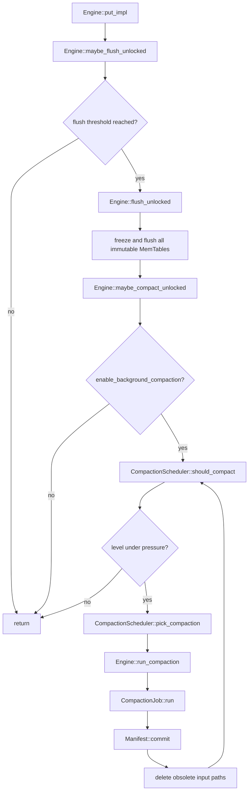
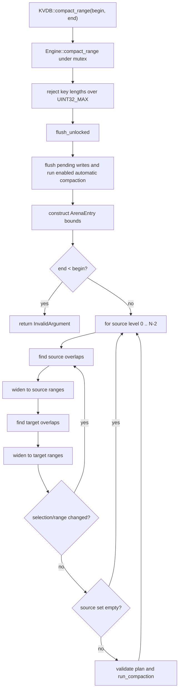
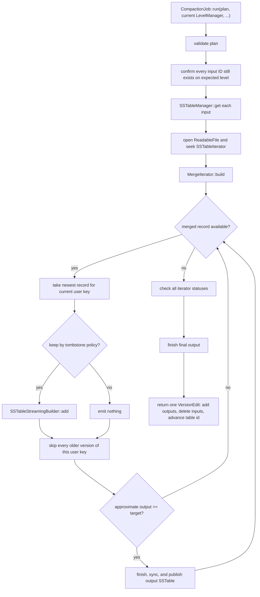
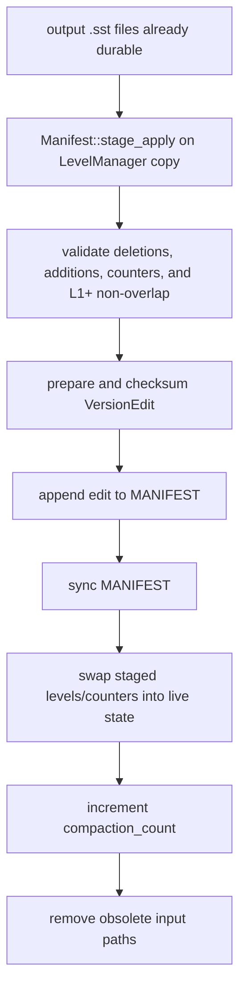

# Compaction: source-level decisions and call paths

This document follows the current automatic and manual compaction code. It
explains how the source selects work, merges records, publishes new files, and
handles failures. It intentionally describes actual behavior—including current
limitations—instead of an idealized LSM architecture.

## Source map

| Responsibility | Source |
|---|---|
| Engine triggers, manual range loop, and publication cleanup | [`src/engine.cpp`](../../src/engine.cpp), [`include/engine.h`](../../include/engine.h) |
| Trigger thresholds and source-table selection | [`src/compaction_scheduler.cpp`](../../src/compaction_scheduler.cpp), [`include/compaction_scheduler.h`](../../include/compaction_scheduler.h) |
| Scheduler option validation | [`src/compaction_options.cpp`](../../src/compaction_options.cpp), [`include/compaction_options.h`](../../include/compaction_options.h) |
| Plan invariants | [`src/compaction_plan.cpp`](../../src/compaction_plan.cpp), [`include/compaction_plan.h`](../../include/compaction_plan.h) |
| Input revalidation, merge, output rolling, and edit construction | [`src/compaction_job.cpp`](../../src/compaction_job.cpp), [`include/compaction_job.h`](../../include/compaction_job.h) |
| K-way internal-key merge | [`src/merge_iterator.cpp`](../../src/merge_iterator.cpp), [`include/merge_iterator.h`](../../include/merge_iterator.h) |
| Version and tombstone retention rule | [`include/compaction_record_policy.h`](../../include/compaction_record_policy.h) |
| Streaming output construction | [`src/sstable_builder.cpp`](../../src/sstable_builder.cpp) |
| Durable SSTable publication | [`src/sstable.cpp`](../../src/sstable.cpp) |
| Atomic metadata edit | [`src/manifest.cpp`](../../src/manifest.cpp) |
| Level ordering and overlap queries | [`src/level_manager.cpp`](../../src/level_manager.cpp) |

## Automatic call path



Despite the option name `enable_background_compaction`, this path does not use
a worker thread. It runs synchronously under `Engine::mutex_`, in the caller
that caused or requested a flush. The loop continues until no configured level
is over its trigger or a step fails.

Calling `Engine::flush()` follows the same `flush_unlocked() ->
maybe_compact_unlocked()` tail, so an explicit flush can also perform multiple
compactions before returning.

## Automatic scheduling decisions

`scheduler_options()` in `src/engine.cpp` copies level counts, thresholds, and
target file sizes from `DBOptions` into the smaller `CompactionOptions` value.
The enable flag is checked by the engine, not by the scheduler.

### Trigger order and exact comparisons

`should_compact()` and `pick_compaction()` use the same priority:

1. L0 first, when `l0_table_count >= l0_file_count_trigger`.
2. Then L1 through the penultimate level, in ascending level order, when
   `sum(file_size) > max_bytes_per_level[level]`.
3. The bottommost configured level is never a source because it has no target.

The higher-level comparison is strictly `>`, whereas the L0 comparison is
`>=`. Byte summation saturates at `UINT64_MAX`, ensuring overflow is interpreted
as pressure instead of wrapping to a small value.

`should_compact()` returns false for invalid options; `pick_compaction()`
returns the validation error. Engine startup already validates its own option
set, so this difference mainly protects direct scheduler callers.

### L0 selection

When L0 reaches its file-count trigger, the scheduler selects **every** current
L0 table as `source_tables`. L0 files may overlap, and `LevelManager` stores
them by descending table ID so newer tables are searched first. Selecting all
of L0 avoids choosing a subset whose overlapping versions would remain in the
same level.

The plan range starts as the union of all selected L0 table ranges. Every L1
table whose inclusive range overlaps that union becomes an
`overlapping_table` and widens the plan range.

### L1+ selection

For a pressured higher level, the scheduler selects one source table: the
largest by `file_size`. There is no persisted compaction pointer, so size is
used to relieve the most pressure instead of repeatedly choosing a fixed key
edge. With equal sizes, the comparator selects the smaller table ID.

It then finds all inclusive overlaps in the adjacent target level and widens
the plan range to include those tables.

### Plan validation before I/O

`CompactionPlan::validate()` rejects a plan unless all of these hold:

- at least one source table exists;
- target level is exactly `source_level + 1` without integer overflow;
- output target size is non-zero;
- plan key bounds are ordered;
- an automatic L0/L1+ reason matches its source-level rule (`Manual` is allowed
  on any non-bottommost source level);
- every table ID is non-zero and unique across both input groups;
- every table belongs to the expected level;
- every table has an ordered range; and
- every input range is contained within the plan range.

The plan stores `TableMeta` snapshots, but job freshness checking later uses
table ID plus expected level, not a field-by-field metadata comparison.

## Manual `compact_range()` path



The flush happens before the source compares `end < begin`. Therefore a
reversed but representable range can still flush pending data—and can run
automatic compaction—before returning `InvalidArgument`.

For each adjacent level pair, manual selection repeatedly expands through
source and destination overlaps until counts and bounds stop changing. It then
compacts the selected tables and moves to the next level pair using the updated
manifest/level state. A single manual request can consequently cascade matching
data from L0 toward the bottommost level.

### Range semantics in the current code

The public header describes `[begin, end)`, but the selection code uses
inclusive table ranges:

```cpp
!(table_largest < requested_smallest) &&
!(requested_largest < table_smallest)
```

It also compacts whole SSTables and does not filter individual records to the
requested bounds. The effective implementation is therefore table-granular,
inclusive overlap followed by transitive range widening. A table that touches
`end`, plus records outside the initial request in a selected table, can be
included. This is current source behavior and should be considered when
changing either the API contract or the implementation.

## `CompactionJob::run()` execution path



### 1. Revalidate before table I/O

The job validates the plan again and checks that every source and target input
ID is still present on its expected level. This makes stale scheduler output
fail before opening files. The engine currently serializes pick, run, and
manifest commit under one mutex, but the check also protects direct job callers
and future scheduling changes.

The overload that does not receive a `LevelManager` intentionally fails with
`InvalidState`; an input-bearing plan cannot be freshness-checked without the
current catalog.

### 2. Pin input tables and iterators

For each source and overlapping target table, the job:

1. Rejects IDs above the `SSTableManager` 32-bit limit.
2. Loads or reuses the table from the manager's ID-keyed cache.
3. Keeps a `shared_ptr<SSTable>` in `pinned_tables` so the table outlives its
   iterator.
4. Opens a readable handle to the final path.
5. Constructs and seeks an `SSTableIterator`.
6. Adds a matching `DeletedTable` to the pending manifest edit.

No metadata has been changed at this stage; the deletions are only an in-memory
proposal.

### 3. Merge in internal-key order

`MergeIterator` stores iterator indices in a priority queue. Its comparator
exposes records in:

```text
user key ascending, sequence number descending
```

Advancing the merge pops only the winning input, advances it once, and pushes
that input back if it remains valid. This yields `O(log input_count)` heap work
per record and avoids copying records into the heap.

For each user key, the first merged record is the newest. The job considers
that one record, then advances past every remaining record with the same user
key. Older versions are unconditionally discarded because KVDB has no snapshot
read API whose historical sequence must remain visible.

### 4. Keep puts; keep tombstones until it is safe to erase them

`compaction_keep_newest_record()` implements the complete retention rule:

```text
newest Put                         -> keep
newest Tombstone, data below       -> keep
newest Tombstone, no data below    -> drop
all older versions                 -> drop
```

“Bottommost” is dynamic. `is_bottommost_destination()` scans every level below
the target and returns true only if all of them are empty (or no such level
exists). It does not perform a per-key overlap test, so any table anywhere below
the target conservatively prevents tombstone dropping.

This policy is correct only while there are no active historical snapshots. If
snapshot reads are introduced, the loop must retain versions needed by the
oldest snapshot instead of skipping every older record.

### 5. Roll output files at an approximate target

The first retained record lazily creates a streaming builder using
`manifest.next_table_id()`. Each builder validates input order and appends
records to an in-memory SSTable representation.

After a user key has been fully consumed, the job asks
`approximate_disk_space()`. If the estimate is greater than or equal to the
plan target, it finishes the current file. The check is intentionally after
adding the record, so the target is not a hard maximum: one record, and its
format overhead, can make the file exceed the requested size. All versions of
one key have already been collapsed, so a file roll never splits a retained
version group.

`finish()` writes the table to its deterministic `.tmp` path, syncs it, closes
it, durably renames it to `.sst`, syncs the parent directory, and derives
`TableMeta` for the target level. The next builder gets the next table ID.

If every input record is a droppable bottommost tombstone, no builder is
created. The returned edit can contain only input deletions, which removes both
the tombstones and the older values they suppress.

### 6. Refuse partial merge output

`MergeIterator::valid()` becomes false both at normal exhaustion and after an
underlying iterator error. The job therefore inspects every input iterator's
status before finishing the last output. Any error discards the proposed edit
and attempts to remove already-finished output paths rather than committing a
partial keyspace.

The job returns a `VersionEdit`; it does not mutate `LevelManager` itself. The
edit includes:

- one deletion for every source and overlapping target input;
- metadata for every finished output in the target level; and
- `next_table_id` when one or more output IDs were consumed.

## Metadata publication and old-file deletion

`Engine::run_compaction()` saves the planned input paths, calls the job, and
passes its edit to `Manifest::commit()`.



New files are durable before metadata references them. Old files remain until
after the manifest edit is durable and live metadata no longer references
them. A crash before commit leaves only unreferenced output files; a crash after
commit may leave unreferenced old input files, but recovery follows the
manifest edit atomically.

`Manifest::commit()` write-poisons the manifest after an uncertain append or
sync failure, preventing a blind retry from appending the same logical edit
twice.

## Failure behavior and cleanup limits

| Failure point | Current source behavior |
|---|---|
| Invalid or stale plan | Fails before input table I/O. |
| Input load/open/seek fails | Returns an error; no manifest state changes. |
| Merge/add/iterator fails | Removes final paths recorded for already-finished outputs and returns no edit. |
| Current builder fails before its metadata is recorded | The general cleanup loop cannot remove an output it does not yet know about; a `.tmp` or just-published untracked file can remain. |
| Manifest validation fails | No edit is appended and live levels remain unchanged; durable output files are left unreferenced. |
| Manifest append/sync fails | Manifest becomes write-poisoned; output files can remain as orphans. Inputs remain in live metadata. |
| Input file deletion fails after commit | Returns an error after metadata and `compaction_count` have changed. The undeleted file is unreferenced. |

There is no start-up orphan scan in the current source. Unreferenced SSTables,
temporary files, and old WALs are not reconciled against the manifest during
`Engine::open()`. During the current process, compaction also does not
explicitly evict obsolete input IDs from `SSTableManager::pool`.

## Current source constraints to preserve or revisit

- **Compaction is synchronous.** The enable flag gates maintenance but does not
  create a background thread.
- **Pick/run/commit must remain serialized.** Output IDs are reserved by reading
  `manifest.next_table_id()` and are only advanced by the returned edit.
- **Output target size is approximate.** It is a post-add roll threshold, not a
  byte cap.
- **No snapshot retention exists.** Exactly one newest record per user key is
  retained, subject to tombstone removal.
- **Manual range semantics differ from the header comment.** Source behavior is
  inclusive and table-granular, not strictly `[begin, end)` record filtering.
- **Automatic overlap expansion is one-pass.** The scheduler widens the range
  after selecting destination overlaps but does not repeat source/destination
  selection to a transitive fixed point. Manual compaction does repeat to a
  fixed point. Changes around boundary-crossing tables must account for this
  difference.
- **Table IDs are 64-bit in manifest metadata but 32-bit in SSTableManager.**
  The scheduler/job rejects inputs or outputs outside the current manager
  limit.

## Tests that encode these decisions

- [`tests/compaction_scheduler_test.cpp`](../../tests/compaction_scheduler_test.cpp)
  checks below-threshold behavior, all-L0 selection, destination overlaps, and
  largest-table L1 selection.
- [`tests/compaction_plan_test.cpp`](../../tests/compaction_plan_test.cpp) checks
  adjacency, uniqueness, level membership, range coverage, and output sizing.
- [`tests/compaction_record_policy_test.cpp`](../../tests/compaction_record_policy_test.cpp)
  checks put/tombstone retention at bottommost and non-bottommost destinations.
- [`tests/compaction_job_contract_test.cpp`](../../tests/compaction_job_contract_test.cpp)
  checks invalid and stale plan rejection before table I/O.
- [`tests/engine_test.cpp`](../../tests/engine_test.cpp) checks automatic and
  manual compaction visibility, tombstones, reopen, and concurrent callers.
- [`tests/level_manager_compaction_regression_test.cpp`](../../tests/level_manager_compaction_regression_test.cpp)
  protects level overlap behavior used by planning and manifest publication.
