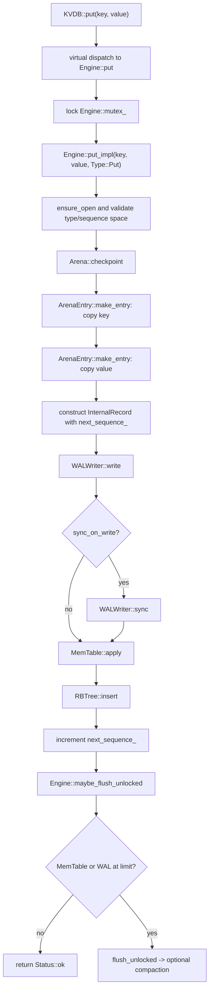
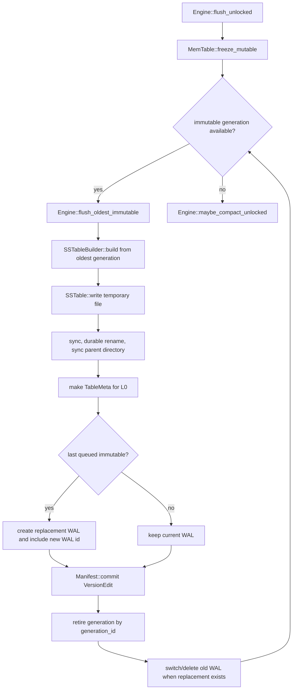

# Adding a new entry (`put` path)

This document follows one `KVDB::put()` call through the current source. It is
about executable ordering, ownership, durability, and failure behavior—not a
general description of the database architecture.

`remove()` uses the same path. Its only semantic difference is that
`Engine::remove()` passes `Type::Tombstone` and an empty value to
`Engine::put_impl()`.

## Source map

| Responsibility | Source |
|---|---|
| Public mutation interface | [`include/kvdb.h`](../../include/kvdb.h) |
| Engine serialization and mutation ordering | [`src/engine.cpp`](../../src/engine.cpp), [`include/engine.h`](../../include/engine.h) |
| Arena-backed key/value copies and checkpoints | [`src/arena.cpp`](../../src/arena.cpp), [`include/arena.h`](../../include/arena.h) |
| In-memory record representation | [`src/record.cpp`](../../src/record.cpp), [`include/record.h`](../../include/record.h) |
| WAL encoding, fragmentation, append, and sync | [`src/wal.cpp`](../../src/wal.cpp), [`include/wal.h`](../../include/wal.h) |
| MemTable generation handling | [`src/mem_table.cpp`](../../src/mem_table.cpp), [`include/mem_table.h`](../../include/mem_table.h) |
| `(key ascending, sequence descending)` index | [`src/red_black_tree.cpp`](../../src/red_black_tree.cpp), [`include/red_black_tree.h`](../../include/red_black_tree.h) |
| Flush-time SSTable construction and publication | [`src/sstable_builder.cpp`](../../src/sstable_builder.cpp), [`src/sstable.cpp`](../../src/sstable.cpp) |
| Durable metadata publication | [`src/manifest.cpp`](../../src/manifest.cpp) |

## Main call path



The engine mutex remains held for the entire diagram, including a threshold
flush and any compaction it triggers. The MemTable also has its own lock, but
the engine lock is the ordering boundary for public writes, sequence-number
assignment, WAL appends, flushes, and metadata publication.

## Step-by-step source behavior

### 1. `Engine::put()` establishes one global mutation order

`Engine::put(std::string&, std::string&)` takes `mutex_` and delegates to:

```cpp
put_impl(key, value, Type::Put);
```

`remove()` takes the same mutex and delegates with `Type::Tombstone`. This
shared path prevents sequence assignment from drifting away from WAL order. A
sequence number is read from `next_sequence_` only while the same lock that
protects the append is held.

`put_impl()` first rejects an unopened/closed engine, an unsupported record
type, and exhaustion of the `uint64_t` sequence space. It deliberately checks
sequence exhaustion before allocating or writing anything.

### 2. The key and value are copied into engine-owned arena storage

The API strings are not retained. `ArenaEntry::make_entry()` allocates storage
from `Engine::arena_`, copies the bytes, and stores the byte count as a
`uint32_t`. Inputs larger than `UINT32_MAX` therefore fail before they can
become records.

Before the first copy, `put_impl()` records an `Arena::Checkpoint`. The
checkpoint captures normal-page count and cursor, dedicated-large-page count,
and registered-destructor count. `Arena::rollback()` can then discard all
allocations made after that point.

The checkpoint exists because key allocation may succeed while value
allocation fails. In that branch the code rolls the arena back to the state
before either copy. A tombstone does not allocate a value; it uses an empty
`ArenaEntry`.

The resulting `InternalRecord` is a shallow tuple of arena references plus:

```text
type = Put or Tombstone
seq_num = current next_sequence_
```

The RB tree and WAL consume those references during the call. The arena owns
the underlying bytes for the engine lifetime; RB-tree nodes do not free them.

### 3. The WAL is appended before the MemTable is changed

`WALWriter::write()` validates the record pointers and type, then encodes this
logical payload:

```text
u32 key_size | u32 value_size | key bytes | value bytes
```

Type and sequence number live in every physical fragment header rather than in
the logical payload. The writer reserves room within fixed-size WAL blocks and
emits one of:

```text
FULL
FIRST -> MIDDLE ... -> LAST
```

Each fragment contains a CRC over its header fields and payload. A logical
record is never allowed to straddle a block as one physical fragment; it is
split instead. This decision lets recovery distinguish a complete record from
an incomplete final fragment without interpreting partial key/value data.

If `options_.wal.sync_on_write` is true, `put_impl()` calls `wal_->sync()`
before making the record visible in the MemTable. If it is false, success means
the bytes were handed to the writable file, not that the operating system has
made them durable on stable storage. `Engine::close()` syncs and closes the
WAL, and a flush can make the entry durable through an SSTable and manifest
commit.

The source ordering is intentionally:

```text
WAL append -> optional WAL sync -> MemTable insert -> sequence increment
```

Putting the WAL first means a process restart can replay a mutation that was
logged but not yet installed in memory. Putting sequence increment after the
MemTable insert prevents an ordinary pre-append failure from consuming a
sequence number.

### 4. The MemTable preserves every version

`MemTable::apply()` takes its exclusive lock and calls `RBTree::insert()`.
The tree orders nodes by:

```text
user key ascending, then sequence number descending
```

Consequently, versions of one key are adjacent and the newest version appears
first. A duplicate is defined by the same key and sequence number; value and
record type are payload, not node identity.

The write path does not overwrite an older version in place. Old values and
tombstones remain available to flush and later compaction. Only after insertion
succeeds does `put_impl()` increment `next_sequence_`.

### 5. Maintenance is part of the `put()` return path

After the record is visible, `maybe_flush_unlocked()` checks two thresholds:

```cpp
mem_table_->mutable_memory_usage() >= options_.memtable.size_limit
wal_->writer().offset() >= options_.wal.file_size_limit
```

Crossing either threshold calls `flush_unlocked()` synchronously, while the
engine mutex is still held. A successful append can therefore incur SSTable
construction, a manifest commit, WAL rotation, and compaction before `put()`
returns.

The configured `memtable.immutable_tables_limit` is validated at startup but
is not consulted by the current engine write path. There is no separate
backpressure branch based on that option in `src/engine.cpp`.

## Threshold-flush call path



`freeze_mutable()` allocates the replacement RB tree before taking its own
exclusive lock. If allocation fails, the active generation is untouched. A
non-empty active tree is enqueued as an immutable `shared_ptr`, assigned a
generation ID, and replaced.

For each oldest immutable generation, the engine:

1. Pins its generation ID.
2. Allocates `manifest_->next_table_id()`.
3. Dumps records in internal-key order and builds an SSTable.
4. Writes to `table-NNNNNNNNN.sst.tmp`, syncs it, renames it to the final
   `.sst` path, and syncs the parent directory.
5. Prepares a `VersionEdit` that adds the table to L0 and advances table and
   sequence counters.
6. If this is the last queued immutable generation, creates a new WAL and adds
   its ID to the same edit.
7. Commits and syncs the manifest edit.
8. Only then retires the immutable generation and, when applicable, switches
   WALs and removes the old WAL.

WAL rotation waits for the final queued immutable because one WAL can contain
records from several frozen generations. Deleting it earlier could discard the
only recovery copy for a generation that has not yet reached an SSTable.

The manifest commit is the publication boundary. The SSTable and replacement
WAL exist durably before the manifest points at them; the old in-memory
generation and old WAL remain until after that pointer change is durable.

## Exact failure boundaries

The return value of `put()` describes the whole call, including maintenance.
It is not a transaction outcome flag for only the logical mutation.

| Failure point | Current source behavior |
|---|---|
| Key allocation fails | Returns the allocation error; no WAL or MemTable change. |
| Value allocation fails | Rolls back to the pre-key arena checkpoint. |
| WAL append fails | Rolls back the arena checkpoint and returns. A partial physical WAL append is not explicitly truncated or write-poisoned here. |
| WAL sync fails | Returns before MemTable insertion. The appended bytes and arena copies are not rolled back because durability is uncertain. |
| MemTable insertion fails | Returns with the WAL record still present; `next_sequence_` is not incremented. Restart may replay that record. |
| Flush/compaction fails | Returns an error after the record was inserted and `next_sequence_` was incremented. The mutation can already be visible and recoverable. |
| Manifest append/sync fails during flush | The `Manifest` becomes write-poisoned; further metadata commits require reopening/recovery. The immutable generation is not retired. |
| Obsolete WAL removal fails after manifest commit | Flush returns an error even though the new metadata/WAL state has already been committed. |

These boundaries explain why blindly retrying the same `put()` after any error
is not guaranteed to be idempotent. In particular, errors after WAL append or
after MemTable insertion represent an uncertain or already-applied mutation.

## Decisions encoded by this path

- **One mutex owns mutation order.** This favors a simple correspondence among
  sequence numbers, WAL order, and maintenance publication over concurrent
  writers inside one engine instance.
- **Arena copies precede logging.** WAL encoding and the MemTable can share one
  stable byte representation, and a checkpoint makes the two-allocation setup
  reversible before append.
- **Logging precedes visibility.** Recovery can reconstruct a mutation that was
  appended immediately before a crash.
- **Every version is retained until compaction.** The write path stays simple;
  version elision and safe tombstone removal happen in the compaction policy.
- **Flush publication is metadata-atomic.** New files are durable first, the
  manifest edit is durable second, and old recovery sources are retired last.
- **Maintenance is synchronous.** Threshold handling applies backpressure
  directly to the writer and avoids a second thread coordinating sequence and
  manifest state.

## Tests that exercise the path

- [`tests/engine_test.cpp`](../../tests/engine_test.cpp) checks put/get/remove,
  automatic flush, reopen through an unflushed WAL, and concurrent clients.
- [`tests/wal_test.cpp`](../../tests/wal_test.cpp) checks record fragmentation,
  recovery, torn tails, and corruption handling.
- [`tests/mem_table_test.cpp`](../../tests/mem_table_test.cpp) checks version
  ordering, freezes, snapshots, and generation retirement.
- [`tests/sstable_pipeline_test.cpp`](../../tests/sstable_pipeline_test.cpp)
  checks the immutable-table build/write/load pipeline used by flush.
