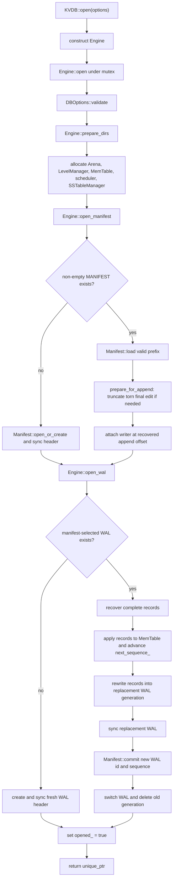

# Database start-up (`open` and recovery path)

This document traces `KVDB::open(options)` through the current implementation.
It focuses on source-level ordering, recovery decisions, filesystem paths, and
failure boundaries rather than presenting a component architecture.

## Source map

| Responsibility | Source |
|---|---|
| Public factory and exception-to-status boundary | [`src/kvdb.cpp`](../../src/kvdb.cpp), [`include/kvdb.h`](../../include/kvdb.h) |
| Start-up orchestration and path selection | [`src/engine.cpp`](../../src/engine.cpp), [`include/engine.h`](../../include/engine.h) |
| Option validation | [`src/db_options.cpp`](../../src/db_options.cpp), [`include/db_options.h`](../../include/db_options.h) |
| Transactional manifest replay and append preparation | [`src/manifest.cpp`](../../src/manifest.cpp), [`include/manifest.h`](../../include/manifest.h) |
| In-memory level invariant reconstruction | [`src/level_manager.cpp`](../../src/level_manager.cpp) |
| WAL header/fragment validation and replay | [`src/wal.cpp`](../../src/wal.cpp), [`include/wal.h`](../../include/wal.h) |
| Platform file open, sync, rename, and directory sync | [`src/file.cpp`](../../src/file.cpp), [`include/file.h`](../../include/file.h) |

## Filesystem paths chosen at start-up

`Engine::prepare_dirs()` derives all live paths from `DBOptions::db_path`:

```text
<db_path>/
├── MANIFEST
├── wal-NNNNNNNNN.log
└── sstables/
    ├── table-NNNNNNNNN.sst
    └── table-NNNNNNNNN.sst.tmp
```

`wal_path(id)` formats the ID with nine decimal digits. SSTable paths are
formatted by `SSTableManager`. Start-up creates the `sstables` directory even
when the database directory already exists.

The directory rules are literal:

- Existing `db_path` must be a directory.
- `error_if_exists=true` rejects an existing database directory before
  examining its manifest.
- Missing `db_path` is created only when `create_if_missing=true`.
- An existing but empty `MANIFEST` is treated like a new manifest.

## Main start-up call path



No `KVDB` pointer escapes before the entire path succeeds.
`KVDB::open()` catches `std::bad_alloc` and ordinary `std::exception` values and
converts them to a failed `Result`. If a status-returning step fails, the local
`Engine` is destroyed instead of publishing a partially opened database.

## Step 1: validation happens before persistent state is opened

`Engine::open()` is idempotent while already open and rejects an instance that
has been closed. On a newly constructed engine it first calls
`DBOptions::validate()`.

Validation is layered by option group and rejects, among other things:

- an empty database path;
- a zero or unrepresentable common block size;
- invalid arena page/large-allocation sizes;
- zero MemTable and WAL limits;
- invalid Bloom filter sizing;
- fewer than two compaction levels;
- level-indexed compaction vectors that do not cover every configured level;
- zero limits for compactable source levels or output levels; and
- a zero manifest size limit.

This ordering avoids creating directories or files for an option set the
engine cannot use. Some validated options are not yet active policy in the
current engine: `memtable.immutable_tables_limit`, `manifest.file_size_limit`,
`sstable_manager.lazy_loading`, and the configurable common `block_size` are
not consulted by the start-up/write orchestration after validation. WAL and
SSTable formats use their format constants.

## Step 2: runtime objects are allocated before recovery is published

After directory preparation, `Engine::open()` constructs:

```text
Arena
LevelManager(max_levels)
MemTable
CompactionScheduler
SSTableManager(<db_path>/sstables)
```

The `LevelManager` starts empty and the `Manifest` replay fills it. The arena
owns key-range bytes loaded from manifest table metadata and bytes decoded from
the WAL. An allocation failure in this block is converted to `OutOfMemory`.

`opened_` remains false throughout manifest and WAL recovery. The flag is set
only after both are append-ready.

## Step 3: manifest recovery rebuilds a staged catalog

### New or empty manifest

`Manifest::open_or_create()` opens the path, initializes the fixed header,
computes its CRC, writes it, and syncs the file. The in-memory allocator
counters begin at:

```text
next_table_id       = 1
current_wal_id      = 1
next_sequence_number = 1
```

Failure while writing or syncing this header write-poisons the manifest
instance.

### Existing non-empty manifest

`Manifest::load()` opens a reader, validates the fixed header, and creates a
separate `LevelManager recovered` plus separate staged counters. It repeatedly
loads checksummed `VersionEdit` records and applies each edit to the staged
objects.

`stage_apply()` removes deleted table IDs, inserts new `TableMeta` values, and
advances optional counters. It rejects counter regressions, duplicate table
IDs, invalid key ranges, L1+ overlaps, and metadata whose table ID is not below
`next_table_id`.

Only after the entire valid prefix passes `check_invariants()` does
`Manifest::load()` swap the recovered levels into the engine's
`LevelManager` and publish the counters. A bad edit therefore does not expose a
partially replayed catalog.

Manifest tail classification is deliberately narrow:

- `UnexpectedEOF` while reading the final edit is a recoverable torn tail. The
  append offset moves back to the beginning of that edit.
- A complete edit with a bad checksum or invalid structure is corruption and
  fails start-up.

`prepare_for_append()` closes the recovery reader and truncates a recoverable
tail to the last complete edit. `attach_writer()` then verifies that the
writable file cursor exactly equals the recovered append offset. This check
prevents appending into the middle of either valid metadata or an untrimmed
partial record.

Manifest replay reconstructs metadata; it does not eagerly open or checksum
every referenced SSTable. Missing or corrupt SSTable files can therefore be
reported later by a read or compaction when `SSTableManager` loads them.

## Step 4: the manifest selects the WAL generation

`Engine::open_wal()` copies these manifest counters first:

```cpp
current_wal_id_ = manifest_->current_wal_id();
next_sequence_  = manifest_->next_sequence_number();
```

WAL ID zero and IDs beyond the manager's current 32-bit limit are rejected as
corruption.

### When the selected WAL is missing

The current source creates a fresh WAL at the same manifest-selected ID and
uses `next_sequence_` as its `start_seq`. `WALWriter::create()` replaces any
file at that path, writes a checksummed 40-byte identity header, and syncs it.

This is a recovery policy worth stating explicitly: a missing selected WAL is
treated as “create an empty current generation,” not as corruption. That is
safe for a newly created database, but it also means start-up does not
distinguish a new database from external deletion of an existing selected WAL.

### When the selected WAL exists

`WAL::recover()` validates that the file-header WAL ID matches the manifest,
checks magic/version/block size/header CRC, and scans physical fragments. Each
fragment CRC covers header fields and payload. `LogicalRecordAssembler`
accepts either a `FULL` record or a valid `FIRST/MIDDLE/LAST` sequence whose
type and sequence number remain constant.

Recovery distinguishes:

- an incomplete final fragment or logical record (`UnexpectedEOF`), which is a
  recoverable torn tail; and
- checksum, format, alignment, or fragment-sequence errors, which are durable
  prefix corruption and fail start-up.

Each complete logical record is decoded into arena storage and later applied
to the MemTable in file order. `Engine::open_wal()` advances
`next_sequence_` to the maximum of the manifest counter and every recovered
`record.seq_num + 1`. It does not require the records to be consecutive. A
maximum sequence value is rejected because no next sequence can be assigned.

The WAL header's `start_seq` is checksummed and retained, but the loader does
not currently compare each recovered sequence against it.

## Step 5: recovered records are migrated to a fresh WAL

The engine does not reopen the recovered WAL for append and does not truncate
its torn tail in place. Instead, it always creates generation
`current_wal_id + 1`, rewrites every complete recovered record, and syncs the
replacement.

If records were recovered, the replacement header uses the first recovered
record's sequence as `start_seq`; otherwise it uses the computed
`next_sequence_`. Rewriting matters because recovered entries are only in the
MemTable—not yet in SSTables—so the replacement WAL must continue protecting
them.

Publication then follows this order:

```text
create replacement WAL
rewrite complete records
sync replacement WAL
commit { current_wal_id = replacement_id,
         next_sequence_number = computed next } to MANIFEST
switch Engine::wal_ to replacement
delete old WAL
```

`Manifest::commit()` first applies the edit to copies of the current catalog
and counters, prepares/checksums it, appends it, syncs the manifest, and only
then swaps the staged state into memory. An append or sync error write-poisons
the manifest because the durable outcome is uncertain.

This ordering makes the important crash windows recoverable:

| Crash point | Manifest still selects | Consequence on next open |
|---|---|---|
| Before replacement WAL is synced | Old WAL | Ignore/replace the incomplete future-generation file and replay the old WAL. |
| After replacement sync, before manifest commit | Old WAL | Replay old WAL; the replacement is an orphan and is replaced when the ID is reused. |
| After manifest commit, before old WAL deletion | Replacement WAL | Replay the replacement; the old WAL is an unreferenced leftover. |

If deleting the old WAL fails after the manifest commit, `Engine::open()`
returns an error even though durable metadata already selects the replacement.
A later open follows that committed state.

## What “open succeeded” guarantees

When `KVDB::open()` returns an object:

- options and directory preconditions passed;
- the manifest header and every replayed complete edit passed validation;
- any torn final manifest edit was removed before append;
- the in-memory level catalog represents the complete valid manifest prefix;
- the current WAL has a synced identity header;
- all complete recovered WAL records are installed in the MemTable;
- recovered records are protected by the manifest-selected WAL generation;
- both manifest and WAL have writable state ready for later calls; and
- `opened_` is true.

It does **not** guarantee that every manifest-referenced SSTable has already
been opened, that unreferenced `.sst`, `.tmp`, or old WAL files have been
garbage-collected, or that background maintenance has run.

## Lifecycle and retry behavior

`Engine::open()` returns success immediately if the same instance is already
open. `Engine::close()` is idempotent, but it permanently sets `closed_`; that
instance cannot be reopened. The public factory creates a new engine for each
open attempt.

`close()` syncs the WAL, syncs the manifest, and closes the WAL. It does not
call `flush_unlocked()`. Unflushed entries are intentionally recovered from the
WAL on the next start-up.

## Tests that exercise the path

- [`tests/engine_test.cpp`](../../tests/engine_test.cpp) checks creation,
  reopen, unflushed-WAL recovery, and post-compaction reopen behavior.
- [`tests/manifest_test.cpp`](../../tests/manifest_test.cpp) checks staged
  replay, tail handling, invariants, append offsets, and write poisoning.
- [`tests/wal_test.cpp`](../../tests/wal_test.cpp) checks headers, fragment
  sequences, torn tails, corruption classification, and replay.
- [`tests/level_manager_test.cpp`](../../tests/level_manager_test.cpp) checks
  the L0 ordering and L1+ non-overlap invariants reconstructed by manifest
  replay.
